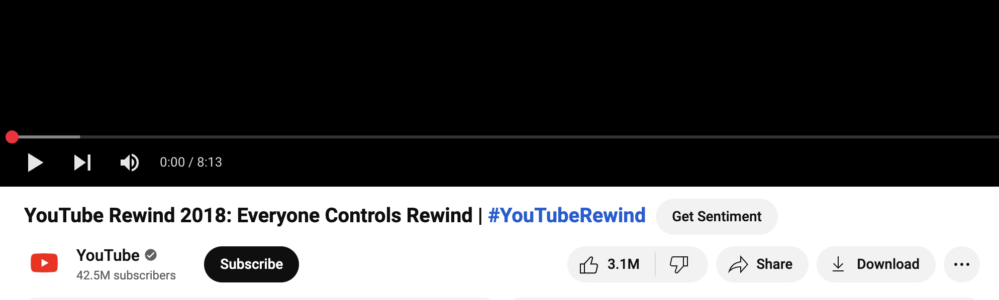
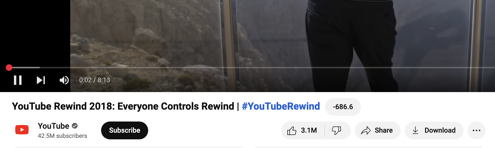
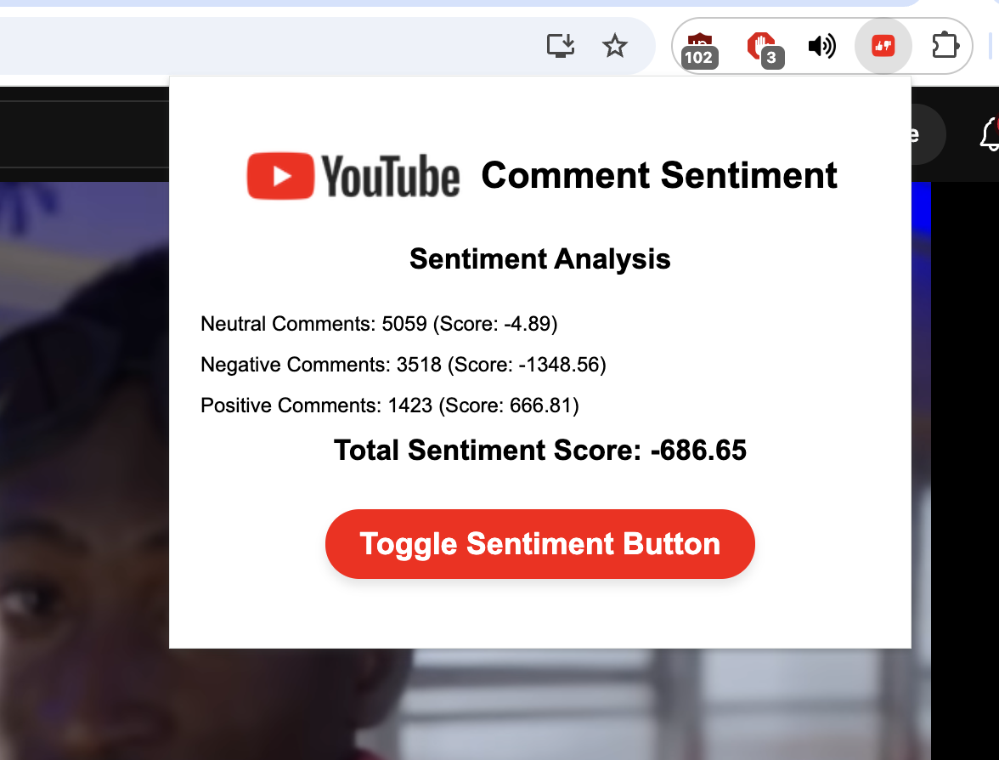

# YouTube Sentiment Analysis Chrome Extension

## Overview

This Chrome extension analyzes the sentiment of YouTube comments on a video using a JavaScript sentiment analysis algorithm using the VADER lexicon. It retrieves comments through the YouTube Data API, processes their sentiment, and displays a breakdown of positive, neutral, and negative comments, along with a total sentiment score.

## Features ✨

- Retrieves up to 10,000 YouTube comments (limited by API constraints).
- Performs sentiment analysis using a custom JavaScript adaptation I made using the VADER lexicon.
- Displays:
  - The number of positive, neutral, and negative comments.
  - The total sentiment score.
- A toggle button beside the YouTube video title to enable/disable sentiment analysis.

## How It Works 🛠️

1. The extension fetches comments using the YouTube Data API.
2. Due to API limitations (~100 comments per request), multiple requests are made in a loop to collect up to 10,000 comments.
3. Each comment is analyzed using a sentiment analysis algorithm that assigns a score based on the VADER lexicon.
4. The total sentiment score is calculated by summing up all individual scores.
5. The extension displays the sentiment breakdown in the popup UI.

## Screenshots 📸

### 1. **"Get Sentiment" Button**
This is what the sentiment analysis button looks like on the YouTube page.

### 2. **Sentiment Results Display**
When you click the "Get Sentiment" button, this is how the sentiment values will appear.

### 3. **Popup UI**
The popup UI displays the breakdown of positive, neutral, and negative comments along with the total sentiment score.

### Important Note

For security reasons, the API key in this repository is hidden. If you would like to test the extension locally, you'll need to replace the placeholders in the code with your own API key.

- `YOUR_YOUTUBE_API_KEY`: Replace this with your YouTube API key.

Once the extension is deployed to the Chrome Web Store, users will not need to manually add these keys.

## Limitations & Future Improvements

### Current Limitations 

- **Comment Retrieval Restrictions**: Due to the API’s limit of ~100 comments per request, fetching large comment datasets requires multiple requests, making retrieval slower for high-comment videos.
- **Recent Comment Bias**: Only the most recent 10,000 comments are analyzed, which may not reflect the overall sentiment history of the video.
- **Sentiment Drift Over Time**: Older videos may have had a negative reception at launch, but newer comments might come from supporters, skewing results toward positivity.

### Potential Improvements 

- Optimize comment retrieval to enhance efficiency.
- Implement sentiment trend tracking over time for older videos.
- Add a loading indicator for better UX while retrieving comments.

## Technologies Used 💻

- **JavaScript** (sentiment analysis, API calls, Chrome extension logic)
- **YouTube Data API** (fetching comments)
- **VADER Lexicon** (sentiment scoring methodology)
- **HTML** (structure for popup UI)
- **CSS** (styling for popup and sentiment button)
